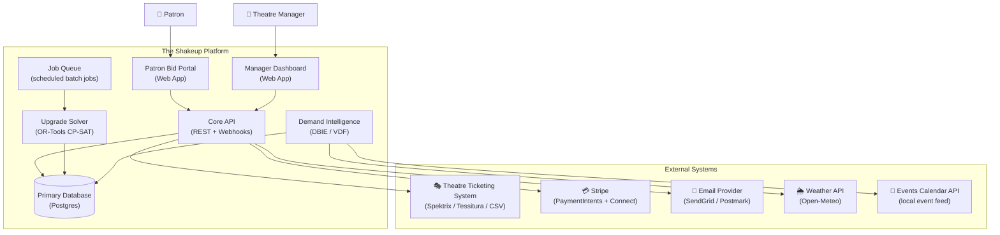
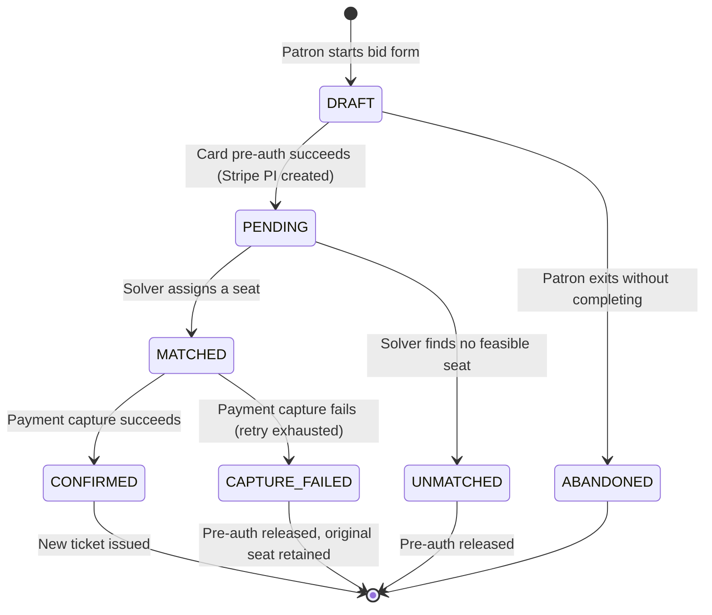
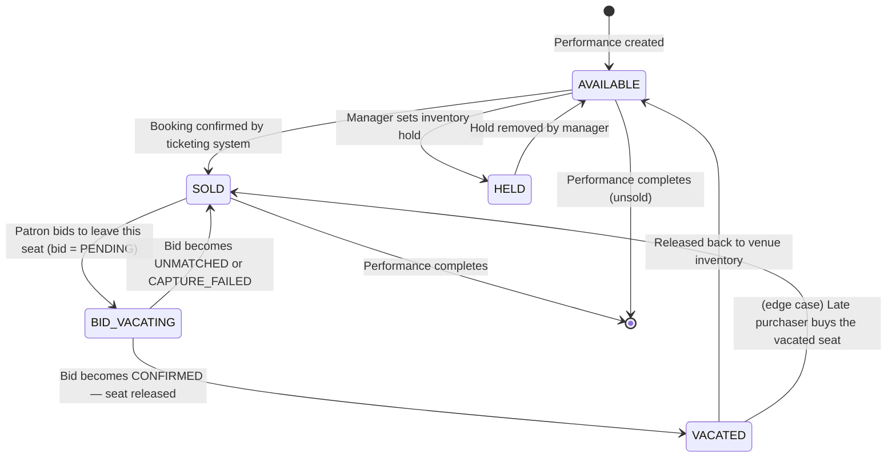
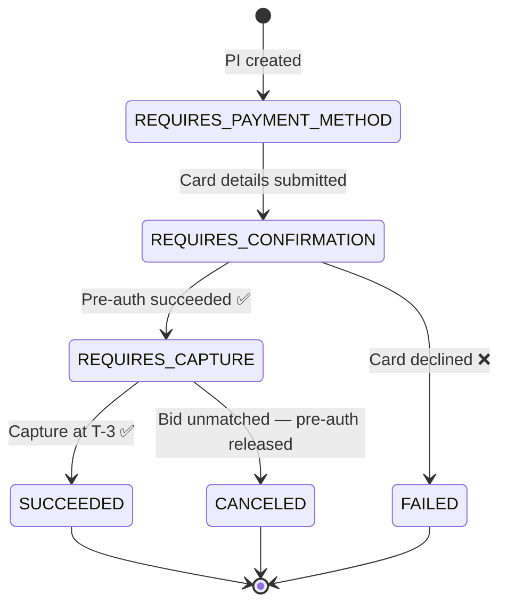
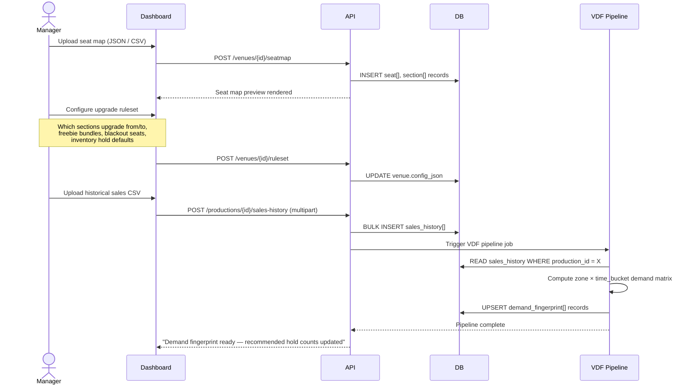
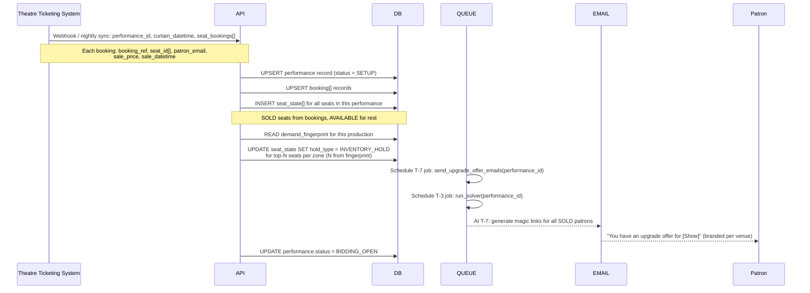
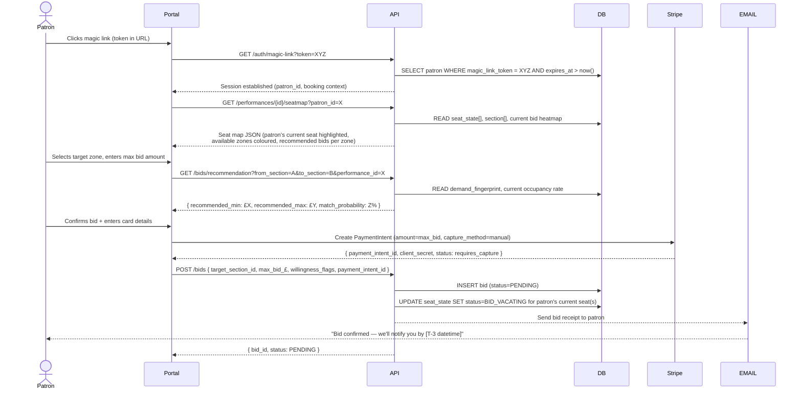
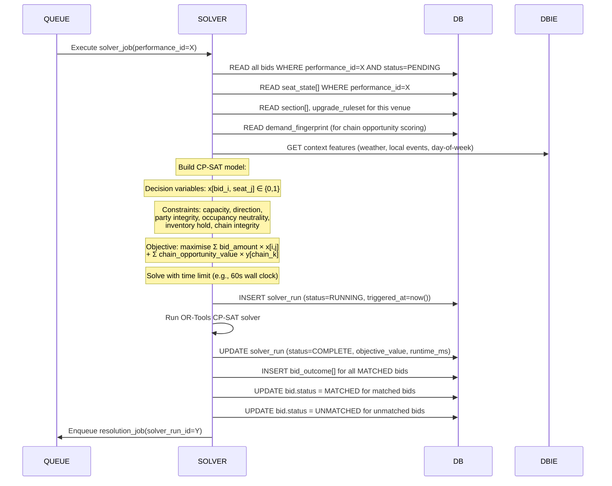
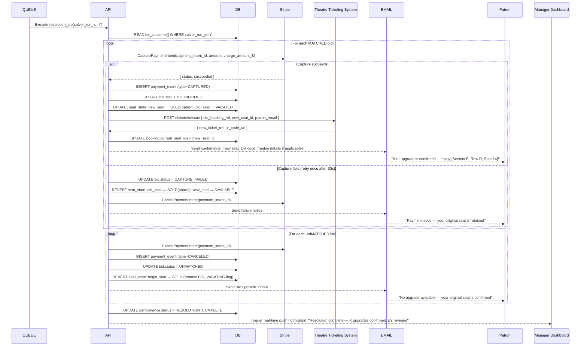
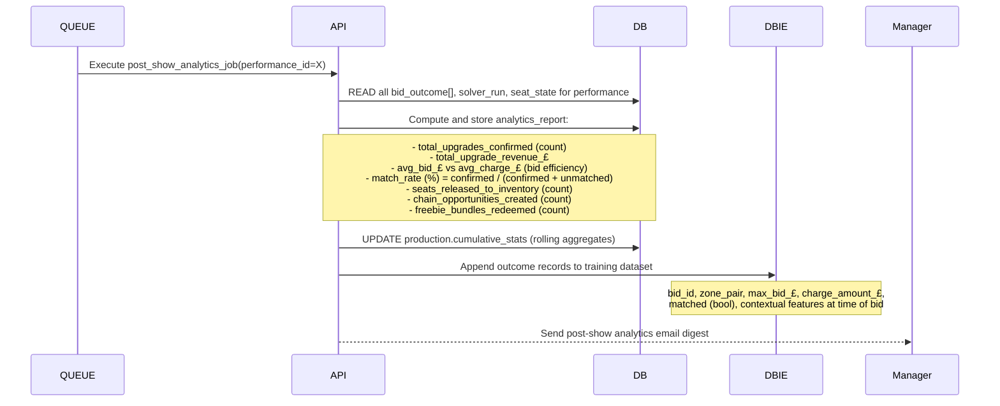

# The Shakeup — Dataflow Specification
### Version 0.1 | 2026-05-25

---

## 1. System Context (C4 Level 1)



---

## 2. Data Entity Catalogue

These are the core tables/documents that data flows through. Every flow below reads or writes these.

| Entity | Key Fields | Notes |
|--------|-----------|-------|
| `venue` | venue_id, name, ticketing_system_type, config_json | One row per theatre building |
| `production` | production_id, venue_id, show_title, genre, start_date | One show run (e.g., "Hamilton — May 2026") |
| `performance` | performance_id, production_id, curtain_datetime, solver_run_at, status | One individual show date/time |
| `seat` | seat_id, venue_id, section_id, row, number, x_coord, y_coord, accessibility_flag, desirability_score | Static; set at venue onboarding |
| `section` | section_id, venue_id, name, face_value_£, desirability_rank, is_upgradeable_from, is_upgradeable_to | Defines upgrade direction |
| `seat_state` | seat_state_id, performance_id, seat_id, status, assigned_patron_id, hold_type | Dynamic per-performance seat map |
| `booking` | booking_id, performance_id, patron_id, original_seat_ids[], ticketing_ref, booking_source | Sourced from theatre ticketing system |
| `patron` | patron_id, email, phone, magic_link_token, token_expires_at | Minimal PII — no account needed at MVP |
| `bid` | bid_id, booking_id, patron_id, performance_id, target_section_id, max_bid_£, willingness_flags, status, payment_intent_id, created_at | Core transactional record |
| `bid_outcome` | outcome_id, bid_id, assigned_seat_id, charge_amount_£, freebie_bundle_id, solver_run_id | Written by solver post-resolution |
| `solver_run` | solver_run_id, performance_id, triggered_at, completed_at, objective_value, runtime_ms, status | Audit record per solver execution |
| `sales_history` | record_id, venue_id, production_id, seat_id, sale_datetime, sale_price_£ | Uploaded by manager; feeds VDF + DBIE |
| `demand_fingerprint` | fingerprint_id, venue_id, production_id, zone_id, time_bucket, p_late_sale, avg_late_price_£, velocity | Output of VDF pipeline |
| `freebie_bundle` | bundle_id, venue_id, description, monetary_value_£, fulfilment_type | e.g., "Bar credit £10 + programme" |
| `payment_event` | event_id, bid_id, stripe_event_type, amount_£, status, occurred_at | Append-only Stripe webhook log |

---

## 3. State Machines

### 3a. Bid Lifecycle



### 3b. Seat State (per Performance)



### 3c. Payment State (Stripe PaymentIntent)



---

## 4. Phase-by-Phase Dataflow

### Phase 0: Venue Onboarding (One-time per Venue)



**Data written in this phase:**
- `venue`, `seat[]`, `section[]` (static; never changes unless venue is refurbished)
- `venue.config_json` (upgrade ruleset)
- `sales_history[]` (raw input)
- `demand_fingerprint[]` (derived output — drives all future inventory recommendations)

---

### Phase 1: Performance Setup (T–14 to T–7)



**Key decisions made in this phase:**
- Which seats enter the upgrade pool (AVAILABLE - HELD = eligible destination seats)
- Which patrons receive emails (all SOLD seats in an upgradeable-from section)
- The solver job scheduled with a hard `execute_at` timestamp

---

### Phase 2: Bid Collection Window (T–7 to T–3)



**Data written in this phase:**
- `bid[]` records (one per zone target per patron — patron may bid on multiple zones)
- `seat_state` updated to `BID_VACATING` for origin seats
- `payment_event` (append-only log of Stripe webhook confirmations)

**Constraints enforced at bid creation time (pre-solver):**
- Patron may not have more than one active bid per performance (they can only move once)
- `max_bid_£ ≥ section.floor_price`
- Target section must be upgradeable-from patron's current section (ruleset check)
- Patron's current seat must be in status `SOLD` or `BID_VACATING` (not HELD or AVAILABLE)
- Pre-auth must succeed before bid record is written

---

### Phase 3: Solver Execution (T–3, Batch Job)

This is the architectural core of the platform.



**Solver I/O Contract:**

**Input document (JSON passed to solver process):**
```
{
  "performance_id": "uuid",
  "seats": [
    { "seat_id": "uuid", "section_id": "uuid", "status": "AVAILABLE|HELD|SOLD|BID_VACATING" }
  ],
  "bids": [
    {
      "bid_id": "uuid",
      "patron_id": "uuid",
      "party_seat_ids": ["uuid", "uuid"],
      "target_section_id": "uuid",
      "max_bid_£": 45.00,
      "willingness_flags": {
        "accept_split_party": false,
        "accept_lateral_move": true,
        "accept_freebie_bundle": true
      }
    }
  ],
  "upgrade_graph": {
    "edges": [{ "from_section": "upper_circle", "to_section": "dress_circle" }]
  },
  "seat_chains": [
    { "chain_id": "uuid", "seat_ids": ["uuid","uuid"], "p_sell": 0.72, "avg_price_£": 85.00 }
  ],
  "chain_weight": 0.6,
  "solver_time_limit_seconds": 60
}
```

**Output document:**
```
{
  "solver_run_id": "uuid",
  "status": "OPTIMAL|FEASIBLE|TIMEOUT",
  "objective_value_£": 1240.00,
  "runtime_ms": 4200,
  "assignments": [
    {
      "bid_id": "uuid",
      "assigned_seat_id": "uuid",
      "charge_amount_£": 35.00,
      "freebie_bundle_id": null,
      "chain_ids_unlocked": ["uuid"]
    }
  ],
  "unmatched_bid_ids": ["uuid", "uuid"]
}
```

---

### Phase 4: Resolution & Ticket Reissuance (T–3, immediately post-solver)



**Atomicity guarantee:** Each bid's capture + seat_state update + ticket reissuance is wrapped in a distributed saga:
- If ticket reissuance fails after payment capture → refund the captured amount automatically and revert seat_state
- Payment event log (`payment_event`) is append-only; never update, only insert

---

### Phase 5: Post-Show Analytics Feed

Runs automatically 24h after curtain.



---

## 5. Critical Data Flows — Edge Cases & Failure Modes

| Scenario | Detection | Resolution |
|----------|-----------|------------|
| Magic link expired (patron clicks email after 7 days) | `token_expires_at < now()` | Return 401; offer to resend link if T–3 not yet passed |
| Patron places bid, then their booking is cancelled by the theatre | Nightly ticketing sync finds booking voided | Auto-cancel bid + release pre-auth; notify patron |
| Stripe pre-auth expires before solver runs (>7 day window) | `payment_intent.status = expired` at solver time | Exclude bid from solver input; notify patron to re-bid if time permits |
| Solver times out without reaching OPTIMAL | `status = FEASIBLE` or `TIMEOUT` in solver output | Use best feasible solution found; log for review; alert Platform Operator |
| Ticket reissuance API call fails after payment captured | Exception in resolution saga | Immediately trigger refund via Stripe; revert seat_state; alert Platform Operator for manual intervention |
| Two patrons bid for the same seat (not a bug — solver handles this) | Solver constraint: seat capacity = 1 | Solver assigns at most one patron per seat; the other bid remains UNMATCHED |
| Party of 2, `accept_split_party = false`, no 2 adjacent seats available in target zone | Solver constraint: party integrity | Bid is UNMATCHED; both patrons retain original seats |
| Chain cascade unwind (Patron A confirmed, Patron B capture fails — both in same chain) | `chain_ids` in bid_outcome links them | Both bids reverted; both patrons retain original seats; A's payment refunded |

---

## 6. Integration Contracts (MVP vs. Full)

| Integration Point | MVP Approach | Full Integration (Phase 2) |
|------------------|--------------|-----------------------------|
| Seat map ingestion | Manager uploads JSON/CSV via dashboard | Direct API pull from Spektrix / Tessitura |
| Booking data sync | Nightly CSV export from ticketing system | Real-time webhook from ticketing system |
| Ticket reissuance | The Shakeup emails a PDF/QR ticket; manager manually voids old ticket | API call to ticketing system: `void_ticket` + `issue_ticket` in one transaction |
| Payment | Stripe PaymentIntents (direct charge to patron) | Stripe Connect (revenue split routed to venue sub-account automatically) |
| Freebie fulfilment | Email voucher code (manual redemption at bar) | POS integration (voucher validated by venue's bar system) |
| Weather data | Open-Meteo REST API (free tier) | Commercial weather API with venue-local station data |

---

## 7. Data Retention & Privacy Notes

- `patron` records contain email only (+ phone optionally). No name, no payment details (Stripe tokenises these).
- `magic_link_token` is a one-time token; expires 7 days after issuance or upon first use, whichever comes first.
- `sales_history` data uploaded by the venue is owned by the venue; The Shakeup uses it only in aggregate/model training form.
- `payment_event` log is retained for 7 years (financial regulation compliance).
- All other transactional data retained for 2 years post-performance, then anonymised (patron_id nulled, email hashed).
- GDPR right-to-erasure: patron_id and email can be nulled on request without breaking referential integrity of analytics aggregates.
