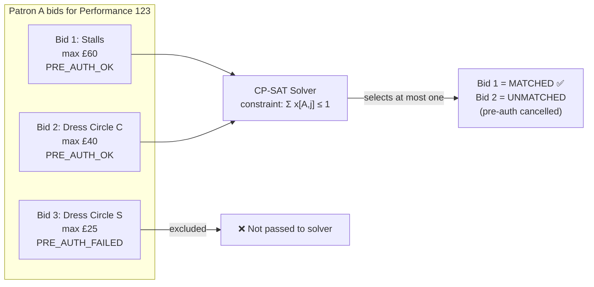
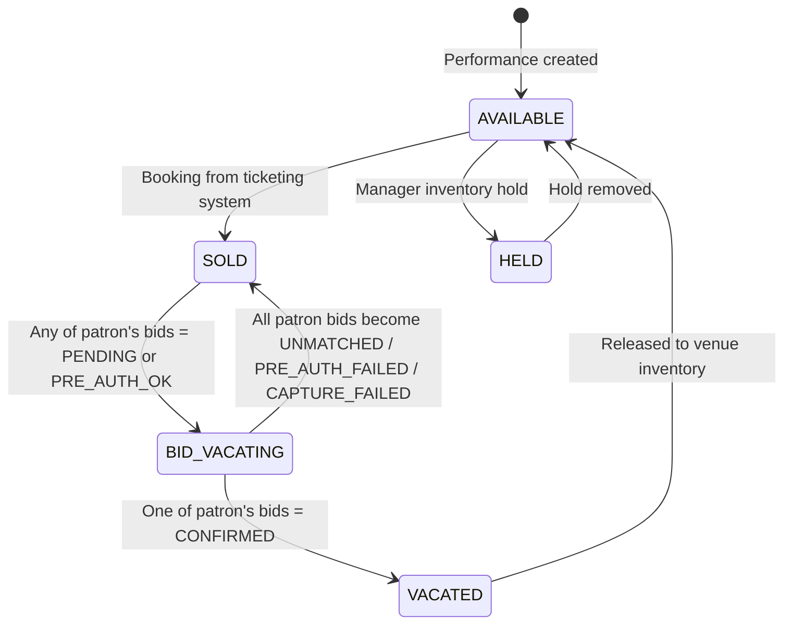
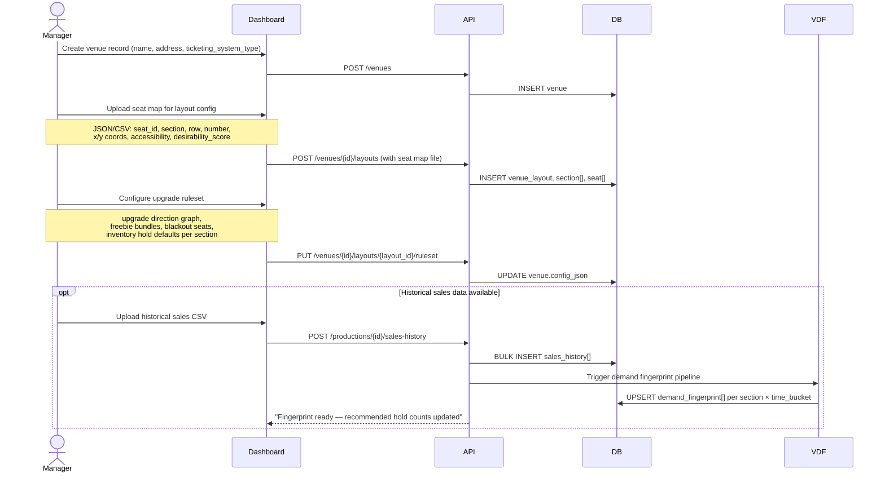
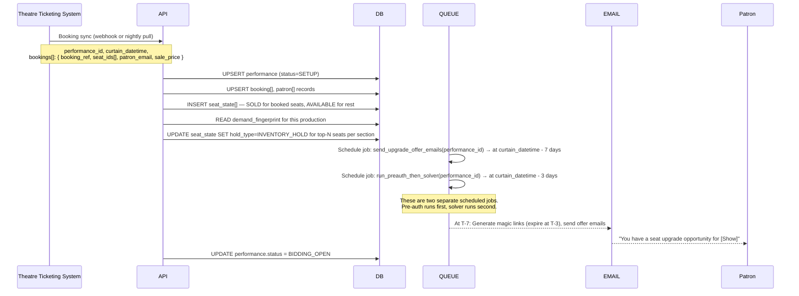
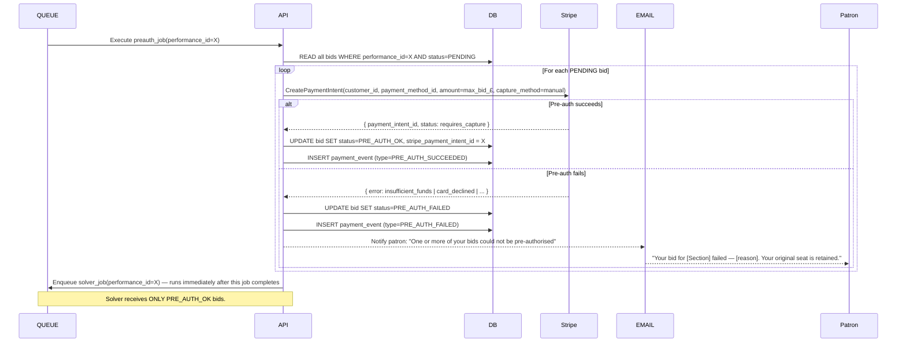
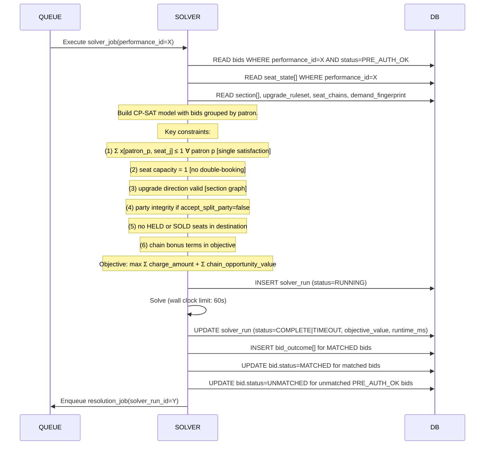

# The Shakeup — Dataflow Specification
### Version 0.2 | 2026-05-25
### Changes from v0.1: Deferred pre-auth, multi-bid per patron, dynamic seat maps, ticketing landscape

---

## 1. Key Architectural Decisions (v0.2 Changes)

### Decision 1: Deferred Pre-Authorisation (replaces instant pre-auth)

**Old model (v0.1):** Pre-auth card at T–7 when bid is placed → 7-day expiry risk → fragile.

**New model (v0.2):**
- Bid placement (T–7 to T–3): patron enters bids **with no card charge or pre-auth**. Card details are stored via a **Stripe SetupIntent** (creates a reusable `PaymentMethod` token). Zero financial commitment at this stage.
- At T–3, Step 1 (pre-solver): The system runs pre-auth on every `PENDING` bid simultaneously. This is a fresh PaymentIntent using the stored PaymentMethod token, `capture_method: manual`.
- Bids where pre-auth fails → status = `PRE_AUTH_FAILED` → excluded from solver input.
- Solver runs only on pre-auth-succeeded bids.
- Matched bids: capture immediately (within same T–3 job).
- Unmatched bids: cancel pre-auth immediately.

**Why this is better:**
- Eliminates the 7-day window problem entirely (pre-auth and capture happen within minutes of each other).
- Patron experience: enter card once when bidding, no further action needed.
- Solver input is clean: every bid it sees has confirmed available funds.
- Edge case: patron whose card fails at pre-auth gets a notification and their bids are excluded — they had T–7 to T–3 to ensure funds were available.

---

### Decision 2: Multiple Bids Per Patron, One Satisfaction

A patron with a restricted-view seat, for example, may bid for multiple target sections simultaneously:

- Bid 1: Stalls, max £60
- Bid 2: Dress Circle centre, max £40
- Bid 3: Dress Circle side, max £25

**Rules:**
- A patron may place **N bids** for different target sections for the same performance.
- The solver enforces: **at most one bid per patron is satisfied** (hard constraint).
- The solver selects which of their bids to satisfy based on the objective function — typically whichever produces the highest revenue or best seat utilisation.
- Optional (Phase 2): patrons can **rank** their bids (preference order). The solver uses this as a tiebreaker.
- Nobody is moved without having actively placed a bid. `BID_VACATING` on a seat is only set when that patron has a `PENDING` bid for that performance.

---

### Decision 3: Dynamic Seat Maps (Venue Layout Configs)

The same physical building can have fundamentally different seat arrangements for different productions:

- A venue might be proscenium for one show, thrust stage for another, theatre-in-the-round for a third.
- Section names, seat numbering, and even total capacity can change.

**Solution:** Introduce `venue_layout` as the entity that `seat` and `section` belong to, rather than `venue` directly.

- `venue` → has many `venue_layout` (e.g., "Standard Proscenium", "Extended Stage Config", "In-the-Round")
- `seat` → belongs to `venue_layout` (not `venue`)
- `section` → belongs to `venue_layout`
- `production` → references a specific `venue_layout_id`
- `seat_state` is per `(performance_id, seat_id)` — since `seat_id` already implies a specific layout, this is correct.

This means a venue manager uploads one seat map per layout configuration (not per show). If a production uses the standard layout, no re-upload is needed. Unusual configurations get their own layout record.

---

## 2. Updated Data Entity Catalogue

| Entity | Key Fields | Notes |
|--------|-----------|-------|
| `venue` | venue_id, name, address, ticketing_system_type, config_json | One row per theatre building |
| `venue_layout` | layout_id, venue_id, name, description, total_capacity | e.g. "Standard Proscenium 1,238 seats" |
| `section` | section_id, layout_id, name, face_value_£, desirability_rank, is_upgradeable_from, is_upgradeable_to | Tied to layout, not venue |
| `seat` | seat_id, layout_id, section_id, row, number, x_coord, y_coord, accessibility_flag | Tied to layout |
| `production` | production_id, venue_id, layout_id, show_title, genre, start_date, end_date | References specific layout |
| `performance` | performance_id, production_id, curtain_datetime, status, solver_run_at | One show date/time |
| `seat_state` | seat_state_id, performance_id, seat_id, status, assigned_patron_id, hold_type | Dynamic; one row per seat per performance |
| `booking` | booking_id, performance_id, patron_id, seat_ids[], ticketing_ref, sale_price_£ | From ticketing system |
| `patron` | patron_id, email, stripe_customer_id, stripe_payment_method_id | Minimal PII; Stripe stores card details |
| `bid` | bid_id, booking_id, patron_id, performance_id, target_section_id, max_bid_£, preference_rank, willingness_flags, status, stripe_payment_intent_id, created_at | Core transactional record |
| `bid_outcome` | outcome_id, bid_id, assigned_seat_id, charge_amount_£, freebie_bundle_id, solver_run_id | Written post-solver |
| `solver_run` | solver_run_id, performance_id, triggered_at, completed_at, objective_value_£, runtime_ms, status, bids_input_count, bids_matched_count | Audit per solver execution |
| `sales_history` | record_id, venue_id, production_id, seat_id, sale_datetime, sale_price_£ | Uploaded by manager |
| `demand_fingerprint` | fingerprint_id, layout_id, production_id, section_id, time_bucket, p_late_sale, avg_late_price_£ | Output of VDF pipeline |
| `freebie_bundle` | bundle_id, venue_id, description, monetary_value_£, fulfilment_type | e.g. "Bar credit £10" |
| `payment_event` | event_id, bid_id, stripe_event_type, amount_£, status, occurred_at | Append-only Stripe log |

---

## 3. Updated State Machines

### 3a. Bid Lifecycle (v0.2 — Deferred Pre-Auth)

```mermaid
stateDiagram-v2
    [*] --> DRAFT : Patron starts bid form
    DRAFT --> PENDING : Card stored via SetupIntent ✅
    DRAFT --> ABANDONED : Patron exits without completing

    PENDING --> PRE_AUTH_FAILED : T-3 pre-auth declined ❌
    PENDING --> PRE_AUTH_OK : T-3 pre-auth succeeded ✅

    PRE_AUTH_FAILED --> [*] : Patron notified; no seat movement

    PRE_AUTH_OK --> MATCHED : Solver assigns a seat
    PRE_AUTH_OK --> UNMATCHED : Solver finds no feasible seat

    MATCHED --> CONFIRMED : Payment captured ✅
    MATCHED --> CAPTURE_FAILED : Capture fails after retry ❌

    CONFIRMED --> [*] : New ticket issued; patron notified
    UNMATCHED --> [*] : Pre-auth cancelled; patron notified
    CAPTURE_FAILED --> [*] : Pre-auth cancelled; original seat retained
    PRE_AUTH_FAILED --> [*]
    ABANDONED --> [*]

    note right of PRE_AUTH_OK
        Only bids in this state
        are passed to the solver
    end note
```



### 3b. Patron's Multi-Bid Constraint (Solver Enforcement)



### 3c. Seat State (unchanged except layout_id anchor)



---

## 4. Phase-by-Phase Dataflow (Updated)

### Phase 0: Venue Onboarding (one-time per venue; repeated per new layout)



---

### Phase 1: Performance Setup (T–14 to T–7)



---

### Phase 2: Bid Collection Window (T–7 to T–3 — open window)

```mermaid
sequenceDiagram
    actor Patron
    participant Portal
    participant API
    participant DB
    participant Stripe
    participant EMAIL

    Patron->>Portal: Clicks magic link
    Portal->>API: GET /auth/magic?token=XYZ
    API->>DB: Validate token; return session (patron_id, performance_id, booking_id)

    Portal->>API: GET /seatmap/{performance_id}?patron_id=X
    API->>DB: READ seat_state[], section[], current bid heatmap aggregates
    API-->>Portal: Seat map + patron's current seat highlighted + available upgrade zones

    Note over Patron,Portal: Patron may place multiple bids for different sections.
    Note over Patron,Portal: They enter card details ONCE for all bids.

    Patron->>Portal: Selects target section, enters max bid amount
    Portal->>API: GET /bids/recommendation?from_section=A&to_section=B&perf_id=X
    API->>DB: READ demand_fingerprint, current occupancy
    API-->>Portal: { recommended_min_£, recommended_max_£, match_probability_% }

    Patron->>Portal: Adds bid to basket (can add multiple target sections)
    Patron->>Portal: Enters card details + submits all bids

    Portal->>Stripe: CreateSetupIntent → confirm → store PaymentMethod
    Stripe-->>Portal: { payment_method_id }

    loop For each bid in basket
        Portal->>API: POST /bids { target_section_id, max_bid_£, preference_rank, willingness_flags, payment_method_id }
        API->>DB: Validate (section upgrade eligible, bid ≥ floor price, patron has no CONFIRMED bid for this performance)
        API->>DB: INSERT bid (status=PENDING)
        API->>DB: UPDATE seat_state: patron's origin seats → BID_VACATING
    end

    API->>Stripe: UPSERT Customer, attach payment_method_id to stripe_customer_id
    API->>DB: UPDATE patron.stripe_customer_id, patron.stripe_payment_method_id

    API-->>EMAIL: Send bid receipt (lists all bids placed, resolution datetime)
    EMAIL-->>Patron: "X bids confirmed — we'll notify you by [T-3 datetime]"
```

**Key validation at bid creation:**
- Patron must have a SOLD seat in an `is_upgradeable_from` section
- Target section must be `is_upgradeable_to` and desirability_rank > patron's current section
- `max_bid_£ ≥ section.floor_price`
- Patron cannot have a bid already in `CONFIRMED` status for this performance
- Patron CAN have multiple `PENDING` bids — this is valid and expected

---

### Phase 3: T–3 Pre-Auth Run (new step, runs before solver)



---

### Phase 4: Solver Execution (T–3, immediately after pre-auth job)



**Handling multiple bids per patron in the solver:**

The solver groups bids by `patron_id`. For patron P with bids B1, B2, B3 (all `PRE_AUTH_OK`):
- The single-satisfaction constraint enforces: `x[P,B1] + x[P,B2] + x[P,B3] ≤ 1`
- If B1 is satisfied (MATCHED), B2 and B3 are set to UNMATCHED and their pre-auths are cancelled
- If no bid for P is satisfiable, all become UNMATCHED

---

### Phase 5: Resolution & Ticket Reissuance (T–3, immediately post-solver)

```mermaid
sequenceDiagram
    participant QUEUE
    participant API
    participant DB
    participant Stripe
    participant TKT as Ticketing System / Manual
    participant EMAIL

    QUEUE->>API: Execute resolution_job(solver_run_id=Y)
    API->>DB: READ bid_outcome[] WHERE solver_run_id=Y

    loop For each MATCHED bid
        API->>Stripe: CapturePaymentIntent(pi_id, amount=charge_amount_£)
        alt Capture succeeds
            API->>DB: UPDATE bid.status=CONFIRMED
            API->>DB: UPDATE seat_state: new_seat → SOLD(patron), old_seat → VACATED
            API->>DB: UPDATE booking.seat_ids = [new_seat_id]
            API->>TKT: Reissue ticket (MVP: email PDF; V1: API call void+issue)
            TKT-->>API: new_ticket_ref
            API-->>EMAIL: Confirmation with new seat + QR + freebie details
            EMAIL-->>Patron: "Upgrade confirmed — [Section, Row, Seat]"
        else Capture fails (retry once, 30s)
            API->>DB: UPDATE bid.status=CAPTURE_FAILED
            API->>Stripe: CancelPaymentIntent(pi_id)
            API->>DB: REVERT seat_state: old_seat → SOLD, new_seat → AVAILABLE
            API-->>EMAIL: Payment failure notice
        end
    end

    loop For each UNMATCHED bid (solver unmatched OR patron's non-selected bids)
        API->>Stripe: CancelPaymentIntent(pi_id)
        API->>DB: UPDATE bid.status=UNMATCHED
        API->>DB: REVERT seat_state if all patron bids now terminal
    end

    API->>DB: UPDATE performance.status=RESOLUTION_COMPLETE
    API-->>Manager Dashboard: Push notification "Resolution complete: X upgrades, £Y revenue"
```

---

## 5. West End Ticketing Landscape & Integration Roadmap

This is the competitive reality you're building against. Each venue group uses a different system, and each requires a different integration strategy.

### Venue Group Map

| Group | Venues | Ticketing System | Integration Complexity |
|-------|--------|-----------------|----------------------|
| **ATG** (Ambassador Theatre Group) | 11 West End venues (Apollo Victoria, Lyceum, Savoy, Phoenix, etc.) | Proprietary ATG system | 🔴 High — requires commercial partnership directly with ATG |
| **Nimax Theatres** | 6 venues (Palace, Lyric, Apollo, Garrick, Vaudeville, Duchess) | TixTrack | 🟡 Medium — TixTrack has partner APIs; need Nimax approval |
| **LW Theatres** | 6 venues (London Palladium, Theatre Royal Drury Lane, His Majesty's, etc.) | Line-Up (since 2024) | 🟡 Medium — Line-Up is newer, may be more partner-friendly |
| **Independent / Arts** | London Coliseum, Barbican, Nederlander venues | Spektrix | 🟢 Low — open partner program, free API access, 650+ clients |
| **Major producing houses** | Various | Mix of above + Ticketmaster distribution | Case by case |

### Integration Roadmap

```mermaid
gantt
    title Ticketing Integration Roadmap
    dateFormat  YYYY-QQ
    section MVP (no API)
    CSV upload + manual reissue :done, mvp, 2026-Q3, 2026-Q4
    section V1
    Spektrix API (read bookings + void/issue) :v1a, 2027-Q1, 2027-Q2
    section V2
    Tessitura REST API :v2a, 2027-Q2, 2027-Q3
    TixTrack partner API (Nimax) :v2b, 2027-Q2, 2027-Q3
    section V3
    Line-Up API (LW Theatres) :v3a, 2027-Q3, 2027-Q4
    ATG commercial partnership :v3b, 2027-Q4, 2028-Q1
```

### Spektrix (V1 Priority — Start Here)

**Why first:** Open partner program, no cost, covers independent West End venues + regional theatres + London Coliseum + Barbican. 650+ client organisations.

**What the API gives you:**
- `GET /performances/{id}/seats` — live seat availability map
- `GET /transactions/{booking_ref}` — booking details (patron, seats, price)
- `POST /transactions/{booking_ref}/seats/transfer` — move a patron from seat A to seat B (this is the reissuance call)
- Webhooks for booking events (new sale, cancellation)

**Access model:** The Shakeup registers as a Spektrix Integration Partner (free). Each venue then grants The Shakeup an API User account for their specific Spektrix instance. OAuth-style per-venue credential.

**Critical capability check:** You need to confirm that Spektrix's `/seats/transfer` or equivalent endpoint can be called programmatically by a third party — i.e., that it's not limited to the venue's own staff. This is the one thing to validate with Spektrix before committing to V1 scope.

### Tessitura (V2)

**Access model:** Venue-mediated — the venue's Tessitura admin creates API credentials for The Shakeup. No direct partner registration. Each venue must individually sponsor access. Primarily used by subsidised/non-profit sector.

**Relevance:** Less relevant for commercial West End; more relevant if expanding to ENO, ROH, or US performing arts centres (Broadway adjacent).

### ATG (V3 — Commercial Deal)

**Reality check:** ATG owns 11 West End venues and runs their own proprietary ticketing. They are not going to give a startup API access to their system. This is a **commercial partnership conversation at the executive level**, not a developer integration task. The pitch to ATG: *"We increase per-patron revenue on shows you're already running, with zero marketing spend from you."* If the MVP demonstrates results with independent venues, ATG becomes a target enterprise partner in Year 2.

---

## 6. Edge Cases & Failure Modes (Updated)

| Scenario | Detection | Resolution |
|----------|-----------|------------|
| Patron places 3 bids; all 3 pre-auth fail at T–3 | All 3 bids → `PRE_AUTH_FAILED` | Notify patron; seat_state reverted for all origin seats → SOLD |
| Patron places 3 bids; solver matches Bid 1, Bids 2+3 are unmatched | Solver output | Capture Bid 1; cancel pre-auths for Bids 2+3; send single confirmation covering all outcomes |
| Venue changes layout after some bookings already exist for a performance | `layout_id` mismatch on existing seat_state | Block layout change via dashboard if any performance has status ≠ SETUP; manager must cancel and recreate |
| Patron booking cancelled by theatre after bid placed | Nightly ticketing sync detects booking = void | Auto-cancel all `PENDING`/`PRE_AUTH_OK` bids for that patron/performance; if any pre-auths are live, cancel them |
| Solver times out (FEASIBLE not OPTIMAL) | `solver_run.status = TIMEOUT` | Use best feasible assignment found; log for platform operator review; alert if objective gap > 20% |
| Chain unwind: Patron A confirmed, Patron B capture fails, both in same chain | `chain_ids` in bid_outcome | Full chain revert: A's payment refunded, both patrons retain original seats |
| Duplicate card stored (patron places bids for two different shows) | `stripe_customer_id` already exists | Reuse existing Stripe Customer; attach new PaymentMethod only if different card provided |

---

## 7. Data Retention & Privacy (unchanged from v0.1)

- `patron` stores email + Stripe token only. No card numbers ever touch The Shakeup's database.
- `magic_link_token`: expires at T–3 (when bid window closes) or on first use, whichever is first.
- `payment_event`: append-only; retained 7 years (financial compliance).
- All other transactional data: retained 2 years post-performance, then anonymised.
- GDPR erasure: `patron.email` → hashed; `patron.stripe_customer_id` → Stripe data deletion request; all bid analytics remain in aggregate form.
- `sales_history` uploaded by venue: venue retains ownership; used only in aggregate for fingerprint computation.
